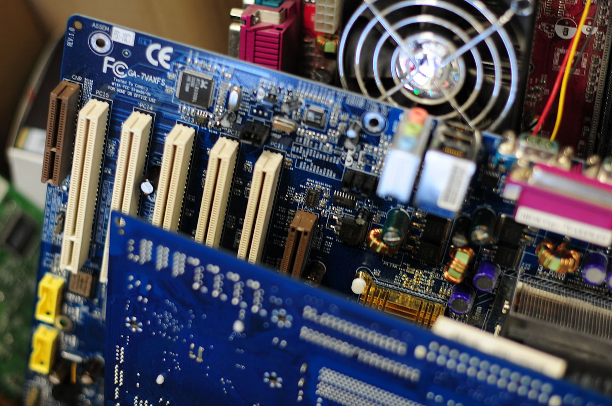

# KOMPUTER

 *Komputer* jest to maszyna elektroniczna przeznaczona do przetwarzania informacji, oraz posiadające zdolność wykonywania wielokrotnie, automatycznie powtarzanych obliczeń, według algorytmicznego wzorca zwanego programem.

*_Programowalność_*

To, co odróżnia współczesne komputery od wszystkich innych maszyn, to możliwość ich programowania, czyli wprowadzenia do pamięci komputera listy instrukcji, które mogą być wykonane w różnym czasie.

Komputery stały się obecnie tak powszechne, iż według słów Normana Ralpha Augustine’a

> Jednym ze zwrotów, które wzbudza dziś największą trwogę jest ‘Komputer nie działa’.

To do:

1. [x] Założyć konto na GitHub
2. [ ] Zapoznać się z SSH (Secure Shell)
